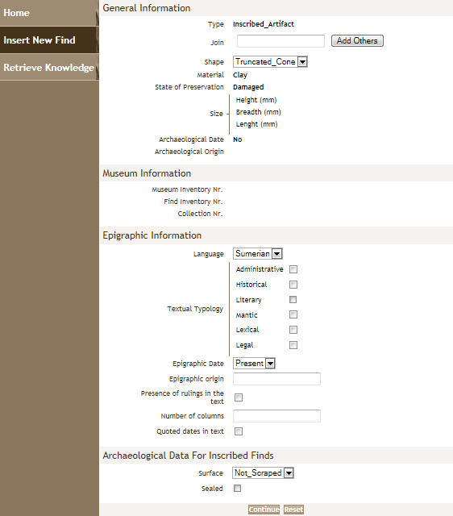

Dhi Qar Knowledge Base
======================

Overview
--------

Epistematica has developed a prototype of a Knowledge-driven System for cataloging 
archaeological and epigraphical finds, that based on Semantic Web
Technologies. It was the Knowledge Base of the **Dhi Qar University and
Heritage Project**.

|Input|

Unlike traditional systems, this cataloguing application makes possible
to classify the archaeological and epigraphic finds according to the
rigour of formal logic. In this way it is possible to use automated
reasoning methods in order to infer hidden or implicit knowledge.

The system is based on OWL language for instancing data and metadata.
The knowledge about the finds is described using Description Logics.

Thanks to this approach, Archaeological finds are catalogued according
to a model that satisfies the requirements of different disciplines
(history of art, epigraphy, anthropology…).

This approach also allows designing of a search system where any user can
exploit the knowledge of all kinds of archaeologists and thus
potentially can discover items whose existence s/he was not even aware
of. As sample of a *Simplified Querying Method* is showed in `ESA Project
OTEG for the GMES Space Component Data Access
<http://wiki.services.eoportal.org/tiki-index.php?page=OTEG+Project>`__.

Design
------

The data structure reflects, and automatically shows, the different ways
in which the different scientists look at and analyze an archaeological
find.

|Graph|

The data model matches the requirements of different disciplines so that
every scientist can enter the form from her/his point of view with all
data s/he can read on the find with no need to respect a mediated
form.

- :download:`Download the documentation <dhiqar-kb.pdf>`

|
|

.. |Graph| image:: graph.png
   :width: 400px
   :height: 400px
